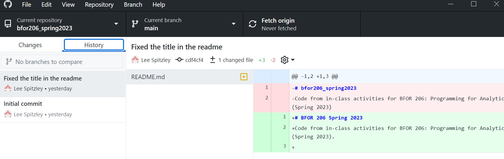

# BFOR 206 Lab
## Class 2-1

# Task Description
Create a Github account (if needed), then create a private
repository for yourself. This is a place where you can store
your lab code. It is also what we will use to submit homework.

# Input
There is no input for this lab.

# Output
To submit this lab, show your Github
Desktop interface with your class repository information.

The screenshot should look like so:

# Submission instructions
Please show the instructor your Github Desktop
interface with your class repository information.
