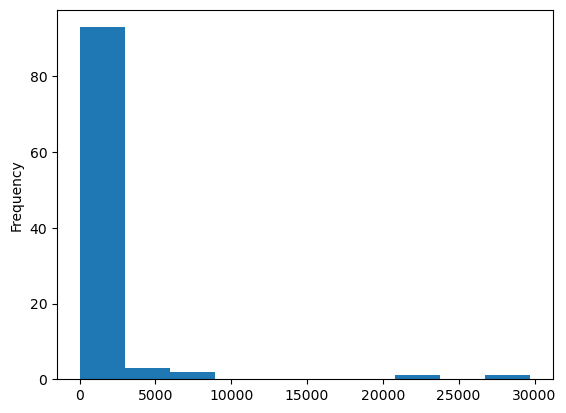

# BFOR 206 Lab
## Class 9-2: Data processing with `pandas`

# Task Description

In this lab, our task is to load posts from reddit into a dataframe
and produce some summary statistics and visualizations.

Before we can produce these results, we will first need to
clean the data somewhat.

# Normal Scenario

## Input
**DataFrame:** You should first create a dataframe of the top 100 posts. See the 
in-class code for how to do this.

## Output
**Terminal:** Tables and plots as described below.

# Test Cases

## Case 1: Plot score histogram
Plot a histogram of the scores of top posts from 
`r/AskReddit` (`score` column)

## Case 2: Extra Credit

Programmatically find and print the row with highest score. (1pt)

# Submission instructions

**Scripts that produce unhandled errors will not be accepted!**

Run your script to show that it produces output that
matches the test cases.

When you are finished, show the instructor:
1.  Your code.
2. A histogram that looks similar to the histogram in the test cases.
3. (Extra Credit) The row with the highest score and the code you used to extract it. 